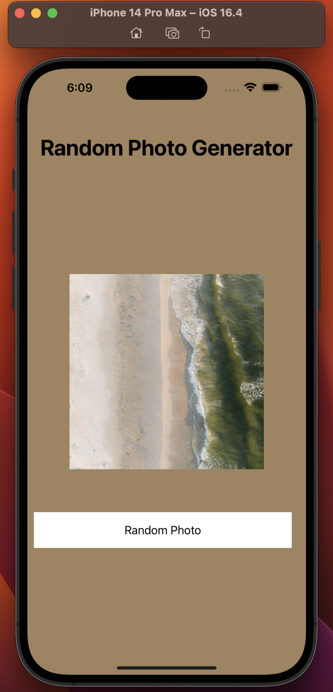
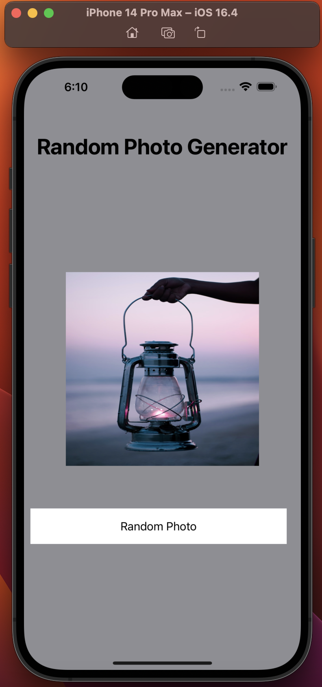

# RandomPhoto App

A responsive iOS application crafted in Swift and UIKit, which seamlessly fetches and showcases random photos from Unsplash with a touch of dynamic background colors.

## Screenshots

## Key Features

- **Instant Random Image**: On app launch, a random image (300x300) from Unsplash graces the screen, positioning itself at the center for an eye-catching view.
  
- **Interactive 'Randomize' Button**: Furnished with a sleek "Random Photo" button, fetching another captivating image from Unsplash is just a click away.

- **Vibrant Dynamic Background**: Keeping user engagement in mind, every click to fetch a new photo is paired with a spontaneous change in the app's background color, selected from a curated palette of colors.

- **Optimal Auto Layout**: Masterfully uses `viewDidLayoutSubviews()` to guarantee flawless UI component sizing and placement, catering to a spectrum of device sizes and orientations.

## Dependencies

- **UIKit**: The backbone for rendering all the intuitive UI components and layout, ensuring a smooth user experience.

## Future Enhancements

While the app provides a seamless experience, continuous improvements are always on the horizon. Here's what's next:

- Integration of more dynamic behaviors, animations, and features to enrich the user experience.
- Exploring advanced caching mechanisms to ensure lightning-fast photo loading times.

> **Note**: When leveraging third-party platforms like Unsplash, it's paramount to stay within API usage guidelines. For projects aiming to scale or distribute extensively, it's advised to integrate the official SDK or have mechanisms in place for handling potential rate limits.
